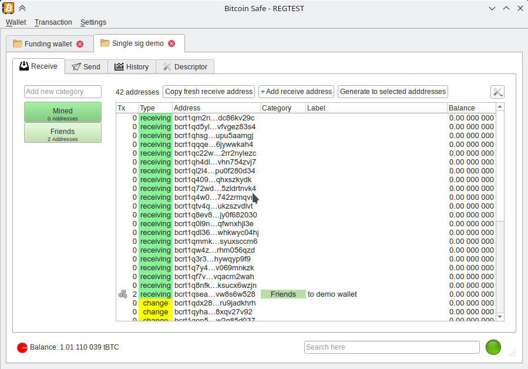
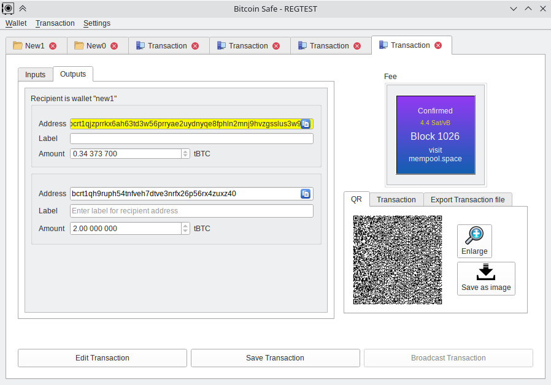

# Bitcoin Safe

### Long-term Bitcoin savings made Easy

## Currently ALPHA -- Use only on regtest / testnet / signet

#### Goals

- **Easy** Bitcoin wallet for long-term cold storage
  - **Best practices** built into the wallet setup 
  - **Easier** address labels by using categories (e.g.  "KYC", "Non-KYC", "Work",  "Friends", ...) 
    - Automatic coin selection within categories
  - **Easier** fee selection for non-technical users 
  - Automatic UTXO management as much as possible to prevent uneconomical UTXOs in the future
    * Opportunistic merging of small utxos when fees are low
- **Fast**: Chain data with **Compact Block Filters** by default   
  - Compact Block Filters are **fast** and **private**
  - Compact Block Filters (bdk) are being [worked on](https://github.com/bitcoindevkit/bdk/pull/1055), and will be included in bdk 1.0.  For now RPC, Electrum and Esplora are available, but will be replaced completely with Compact Block Filters.
- **Secure**: No seed generation or storage (on mainnet). A hardware signer/signing device will be needed (storing seeds on a computer is  reckless)
  - Powered by **BDK**, using some graphical elements from Electrum, and inspired keystore UI  by Sparrow
  - There should be no privacy leaking data at rest (i.e. encrypted wallet file + databases)


#### Design principles

* KISS
  * If a new user needs a tutorial video, it is too difficult

* Only present safe options to the user (on mainnet) (warnings are typically ignored by everyone)
* Add options only if they are needed
  * Example: 1 unified amount formatting (credit to Seed Signer) is sufficient:  0.12 345 678 BTC     (no mBTC , Sats, needed)

#### TODOs (a lot)

- [ ] Add guide steps after the wallet setup
  - [x] Create recovery pdf with descriptor and further short instructions   
  - [ ] Wallet setup guide for wallet consistency
    - Goal: Backup seed phrases are correct
      - [ ] Send small amount of funds to the wallet
      - [ ] Wipe hardware signers
      - [ ] Read xpubs from hardware signers again (verify they have not changed)
    - Goal: Singing device 1, 2, and 3 create valid signatures 
      - [ ] Create tx and sign with Dev 1 and Dev 2  send to own address
      - [ ] Create tx and sign with Dev 1 and Dev 3 and sent to own address
- [x] Network UI configuration 
  - [x] Setting of custom CBF node ip and port
- [x] CTRL + C  and CSV export across all tables
- [x] Send
  - [x] Coin selection (categories+ manual), singing (with seed on regtest), and broadcasting 
  - [x] Opportunistic consolidation within coin categories, when fees are low
  - [ ] hardware signers: HWI USB, 
    - [x] SD card
    - [x] QR code reader
- [x] Address and TX labeling using categories
  - [ ] Label p2p Synchronization via nostr direct encrypted messages (+2. layer of encryption)
- [x] Address dialog & TX dialog
- [x] [BIP329](https://github.com/bitcoin/bips/blob/1d15f3e0f486ea142b5fdef856ab5a4bbb166e01/bip-0329.mediawiki#L4)
- [ ] Adding tests for rigorous UI testing
- [ ] CPFP, RBF
- [ ] Wallet settings  (location, password,...) needs a tab
- [ ] multi language
- [x] add scan qr code in lots of places
- [ ] Include listening to p2p traffic for new tx announcements
  - [ ] Include desktop notifications (via tray icon)
- [ ] PSBT exchange for Multisig signing over Nostr encrypted messages (+ 2. layer of encryption)


#### UX




#### Screenshots




## Installation

 * Install Bitcoin Safe dependencies

   ```sh
   git clone https://github.com/andreasgriffin/bitcoin-safe.git
   cd bitcoin-safe
   pip install --requirement requirements.txt 
   ```
   
 * Run Bitcoin Safe

   ```sh
   python -m bitcoin_safe
   ```


### Development

* Change requirements:

```shell
pipreqs  --savepath requirements.in  --force .
pip-compile --generate-hashes --resolver=backtracking   requirements.in
pip install --requirement requirements.txt 
```

* Automatic commit formatting

```shell
pip install pre-commit
pre-commit install
```

