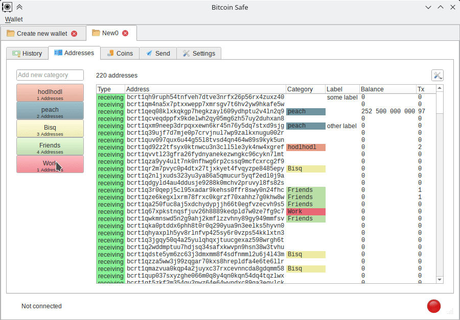
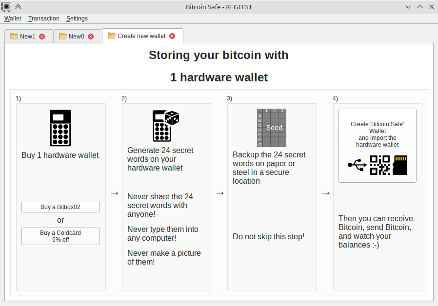
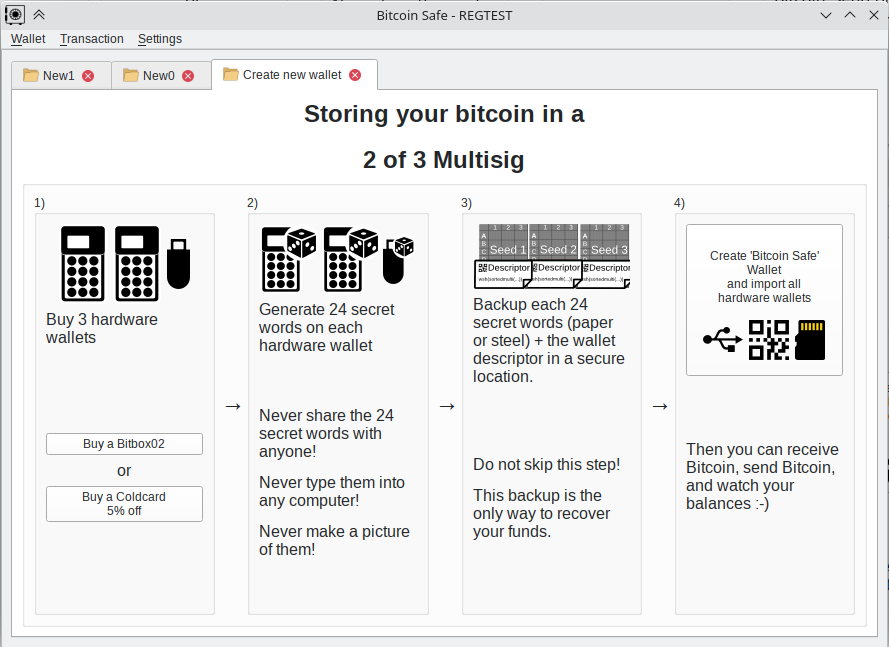
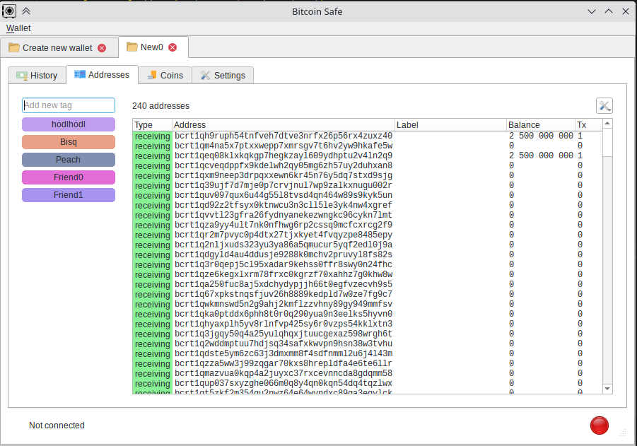
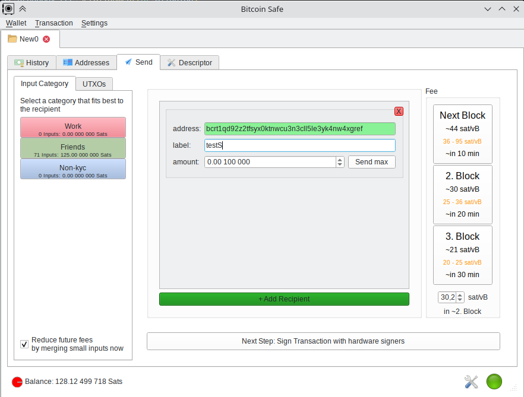
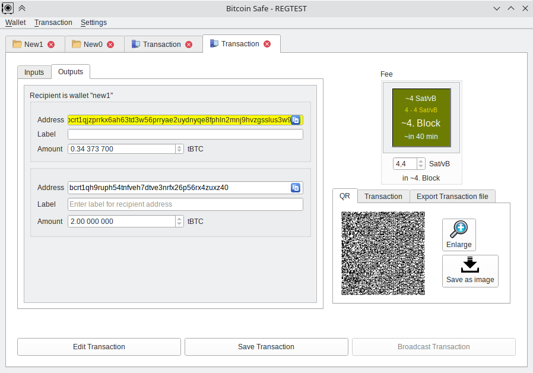

# Bitcoin Safe

### A savings wallet for the whole family

## Currently Pre-ALPHA -- Use only on regtest 

#### Goals

- An **easy** to use Bitcoin wallet for the entire family
  - Wallet setup with **best practices** built in the wallet setup
  - **Easier** labels by using categories (e.g.  from Hodlhodl, from Bisq, from Peach, ...)
- Powered by **BDK**, using some graphical elements from Electrum, and inspired keystore UI  by Sparrow
- Chain data with **Compact Block Filters** by default (other options like bitcoin rpc, electrum perhaps later)
  * Compact Block Filters are **fast** and **private**
  * Compact Block Filters (bdk) are experimentally already available in python, see [here](https://github.com/bitcoindevkit/bdk-ffi/pull/379)
- **Secure** by default: No seed generation or storage (on mainnet). A hardware wallet/signing device will be needed (storing seeds on a computer is just reckless)

#### TODOs (a lot)

- [ ] Add guide steps after the wallet setup
  - [ ] Create recovery pdf with descriptor and further short instructions 
  - [ ] Testing the backup
    - [ ] Send small amount of funds to the wallet
    - [ ] Wipe the wallet and the hardware wallets
    - [ ] Restore the wallet + Hardware wallets and send funds to a new address
- [x] Network UI configuration 
  - [x] Setting of custom CBF node ip and port
- [x] CTRL + C  and CSV export across all tables
- [x] Send
  - [x] Coin selection (categories+ manual), singing (with seed on regtest), and broadcasting 
  - [x] Opportunistic consolidation within coin categories, when fees are low
  - [ ] Hardware wallets: HWI USB, SD card, QR code reader
- [x] Address and TX labeling using categories
  - [ ] Label p2p Synchronization via nostr direct encrypted messages (+2. layer of encryption)
- [x] Address dialog
  - [x] automatically create qr code
- [ ] TX dialog (need redesign. Electrums are too complicated)
  - [ ] What does the normal user actually want to see here?
- [ ] Adding tests for rigorous UI testing
- [ ] Wallet settings  (location, password,...) needs a tab
- [ ] add scan qr code in lots of places
- [ ] Include listening to p2p traffic for new tx announcements
  - [ ] Include desktop notifications (via tray icon)
- [ ] PSBT exchange for Multisig signing over Nostr encrypted messages (+ 2. layer of encryption)


#### UX



#### Screenshots













## Installation

 * Installation of bdk with compact filters

   ```shell
   git clone https://github.com/andreasgriffin/bdk-ffi.git
   cd bdk-ffi/bdk-python
   git checkout cbf
   pip install --requirement requirements.txt
   bash ./generate.sh
   python setup.py bdist_wheel --verbose
   pip install ./dist/bdkpython-0.30.0.dev0-cp310-cp310-linux_x86_64.whl --force-reinstall
   python -m unittest --verbose tests/test_bdk.py
   ```

 * Run a bitcoin regtest node with compact block filters enabled. The simplest is to use this [docker](https://github.com/BitcoinDevelopersAcademy/bit-container#2-create-regtest-aliases-to-start-stop-view-logs-and-send-cli-commands-to-container) container. You can create the alias:

   ```sh
   alias rt-start='sudo docker run -d --rm -p 127.0.0.1:18443-18444:18443-18444/tcp -p 127.0.0.1:60401:60401/tcp --name electrs bitcoindevkit/electrs'
   alias rt-stop='sudo docker kill electrs'
   alias rt-logs='sudo docker container logs electrs'
   alias rt-cli='sudo docker exec -it electrs /root/bitcoin-cli -regtest   $@'
   ```

 * Run Bitcoin Safe

   ```sh
   git clone https://github.com/andreasgriffin/bitcoin-safe.git
   cd bitcoin-safe
   python -m bitcoin_safe
   ```


### Development

```shell
pipreqs  --savepath requirements.in  --force .
pip-compile --generate-hashes --resolver=backtracking   requirements.in
pip install --requirement requirements.txt 
```

