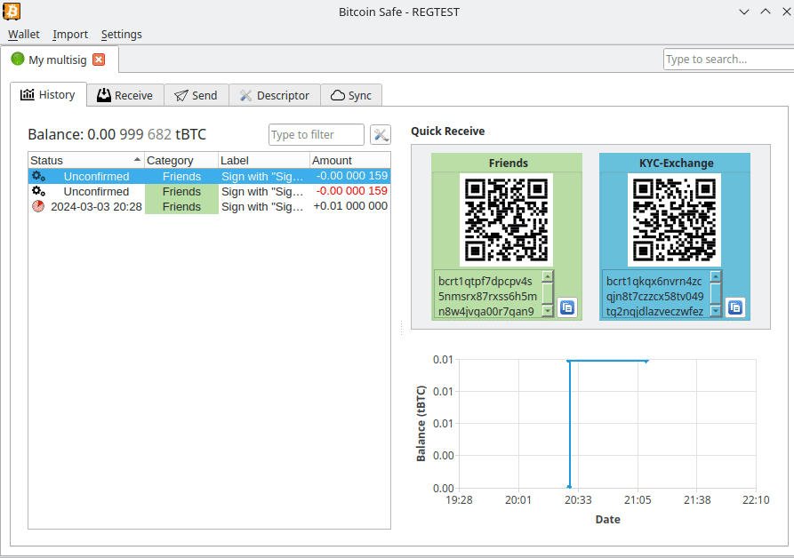

# Bitcoin Safe

### Long-term Bitcoin savings made Easy

## Currently ALPHA -- Use only on regtest / testnet / signet

#### Features

- Single and 2-of-3 Multisig wallet **guide**

- Search across all wallets

- RBF and Cancel unconfirmed transactions

- Category labeling of addresses 

- Label synchronization between trusted devices   (via nostr)

- Wallet chat and sharing of PSBTs   (via nostr)

#### Preview

##### Sending



##### Setup a multisig wallet


##### PSBT sharing with trusted devices


##### Label Synchronization with trusted devices


#### Goals (for the 1.0 Release)

- **Easy** Bitcoin wallet for long-term cold storage
  - **Best practices** built into the wallet setup
  - **Easier** address labels by using categories (e.g. "KYC", "Non-KYC", "Work", "Friends", ...)
    - Automatic coin selection within categories
  - **Easier** fee selection for non-technical users
  - Automatic UTXO management as much as possible to prevent uneconomical UTXOs in the future
    - Opportunistic merging of small utxos when fees are low
- **Fast**: Chain data with **Compact Block Filters** by default
  - Compact Block Filters are **fast** and **private**
  - Compact Block Filters (bdk) are being [worked on](https://github.com/bitcoindevkit/bdk/issues/679), and will be included in bdk 1.1. For now RPC, Electrum and Esplora are available, but will be replaced completely with Compact Block Filters.
- **Secure**: No seed generation or storage (on mainnet). A hardware signer/signing device will be needed (storing seeds on a computer is reckless)
  - Powered by **BDK**, using some graphical elements from Electrum, and inspired keystore UI by Sparrow
  - There should be no privacy leaking data at rest (i.e. encrypted wallet file + databases)

#### Design principles

- KISS: If a new user needs a tutorial video, it is too difficult

- Only present safe options to the user (on mainnet) (warnings are typically ignored by everyone)

- Choose sane defaults and add config options only if they are needed

#### TODOs (getting less)

- [ ] CPFP show combined fee rate
- [ ] multi language
- [ ] Add more pytests
- [ ] [bbqr code](https://bbqr.org/)
- [ ] Include listening to p2p traffic for new tx announcements
  - [ ] Include desktop notifications (via tray icon)

## Installation

* Install dependencies and setup poetry
  
  ```sh
  sudo apt install libsecp256k1-1
  git clone https://github.com/andreasgriffin/bitcoin-safe.git
  cd bitcoin-safe
  ```

* Setup poetry and install dependencies 
  
  ```sh
  pip install poetry
  poetry install
  ```

* Run  
  
  ```sh
  poetry shell
  python -m bitcoin_safe
  ```

### Development

* Install  requirements:

```shell
poetry install
poetry shell
```

* Automatic commit formatting

```shell
pip install pre-commit
pre-commit install
```

* Run the precommit manually for debugging

```shell
pre-commit run --all-files
```

* 
* 

#### Regtest docker environement with electrs and mempool

* install docker

```shell
# see https://docs.docker.com/engine/install/ubuntu/
```

* setting up a regtest environment in docker + mempool instance

```shell
curl https://getnigiri.vulpem.com | sudo bash # see https://nigiri.vulpem.com/#install
sudo nigiri start
xdg-open http://localhost:5000/
```

* This creates
  * esplora localhost:3000
    electrs localhost:50000 
  * and a gui block explorer at http://localhost:5000
* Setup mempool instance

```shell
sudo apt install docker-compose
git clone https://github.com/ngutech21/nigiri-mempool.git

pushd nigiri-mempool
sudo docker-compose up -d
sleep 10
# this is needed because the database needs time to start up 
sudo docker-compose up -d
popd
xdg-open http://localhost:8080/

# if the mempool is endlessly loading, then get the debug output with
sudo docker-compose logs -f mempool-api
```

* this opens a mempool at http://localhost:8080/

#### Control the Regtest environment

* get coins to an address

```shell
nigiri rpc generatetoaddress 1 bcrt1qgsnt3d4sny4w4zd5zl9x6jufc5rankqmgphyms9vz0ds73q4xfms655y4c # mine blocks

# or use the internal faucet
nigiri faucet bcrt1qgsnt3d4sny4w4zd5zl9x6jufc5rankqmgphyms9vz0ds73q4xfms655y4c 0.01
```

* 
