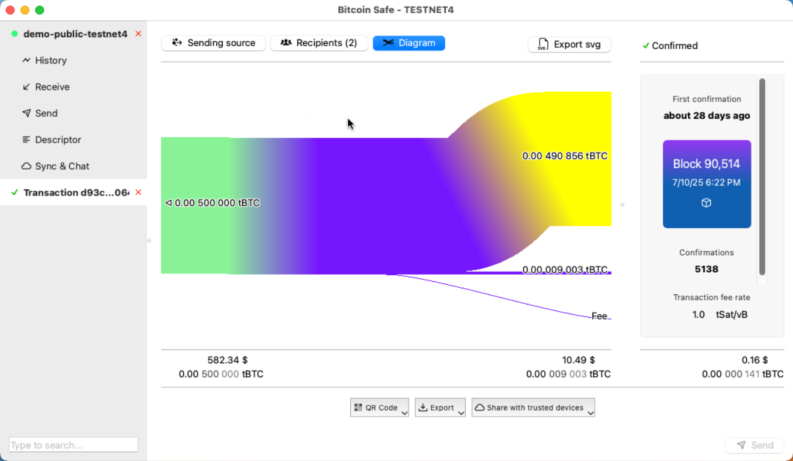

# Bitcoin Safe

#### A bitcoin savings wallet for the entire family

- **Easy** Multisig-Wallet Setup
  - Step-by-Step instructions for a secure MultiSig setup with PDF backup sheets
  - Test transactions ensure that all hardware signers are ready
  - Full support for [Coldcard](https://store.coinkite.com/promo/8BFF877000C34A86F410), [Coldcard Q](https://store.coinkite.com/promo/8BFF877000C34A86F410), [Bitbox02](https://shop.bitbox.swiss/?ref=MOB4dk7gpm), [Blockstream Jade](https://store.blockstream.com/?code=XEocg5boS77D), [Trezor](https://affil.trezor.io/SHtNo), [Foundation Passport](https://foundation.xyz/passport), [Keystone](https://keyst.one), [Ledger](https://shop.ledger.com/?r=400f1fff75b5), [Specter DIY](https://clavastack.com/en/?coupon=bitcoin-safe), [SeedSigner](https://seedsigner.com), [Krux](https://selfcustody.github.io/krux), using  *QR*, *USB*, and *SD-card* 
- **Secure**: Hardware signers only
  - All wallets require hardware signers/wallets for safe seed storage 
  - Powered by **[BDK](https://github.com/bitcoindevkit/bdk)**
- **Multi-Language**:
  - 🇺🇸 English, 🇨🇳 Chinese – 简体中文, 🇪🇸 Spanish – español de España, 🇯🇵 Japanese – 日本語, 🇷🇺 Russian – русский, 🇵🇹 Portuguese – português europeo, 🇧🇷 Portuguese (Brazil) – português do Brasil, 🇮🇳 Hindi – हिन्दी, 🇦🇪 Arabic – العربية, 🇮🇹 Italian – italiano, 🇫🇷 French – Français, 🇩🇪 German – Deutsch, 🇲🇲 Burmese – မြန်မာ, 🇰🇷 Korean – 한국어, 🇹🇭 Thai – ภาษาไทย, 🇮🇷 Persian (Farsi) – فارسی, 🇵🇱 Polish – Polski, 🇪🇸 Catalan – Català, 🇮🇩 Indonesian – Bahasa Indonesia, 🇹🇷 Turkish – Türkçe, 🇺🇦 Ukrainian – Українська (more upon request)
- **Simpler** address labels by using categories (e.g. "KYC", "Non-KYC", "Work", "Friends", ...)
  - Automatic coin selection within categories
  - Transaction flow diagrams, visualizing inputs and outputs, click on inputs and output to trace the money flow
- **Sending** for non-technical users
  - 1-click fee selection via mempool-blocks
  - Automatic merging of utxos when fees are low
- **Sync & Chat**:
  - Encrypted cloud backup (via nostr) of labels
  - Label synchronization between different computers
  - Wallet chat and PSBTs sharing between different computers
- **Fast**: 
  - Electrum/Esplora server
  - Compact Block Filters 


### Available on all platforms
|  |  |  |
|-----------------------------|-----------------------------|----------------------------|
| Windows                    | Mac OS X                   | Linux                     |


## Comprehensive Feature List

- **Import and Export Capabilities**
  
  - CSV export for all lists
  - CSV import for batch transactions
  - Label import and export using [BIP329](https://bip329.org/)
  - Label import from Electrum wallet
  - Export of the money flow diagram to svg
  - Drag and drop for Transactions, PSBTs, and CSV files

- **Wallet Features**
  
  - Simplified address labeling using categories like KYC, Non-KYC, Work, Friends
  - Bump fee on transactions (via Replace-by-Fee)
  - Receive faster (via Child Pays For Parents)
  - Encrypted wallet storage
  - Backup PDF with Descriptor (Text and QR code)
  - Message signing via USB and QR

- **Hardware Signer Connectivity**
  
  - MicroSD (files)
  - USB
  - QR codes (enhanced QR code detection for Laptop cameras)
  - Animated QR codes including [Coldcard/BBQr](https://bbqr.org/) and [UR](https://github.com/BlockchainCommons/Research/blob/master/papers/bcr-2020-005-ur.md) format

- **Search and Filtering Options**
  
  - Fast filtering across txids, utxos, labels, dates, amounts, categories
  - Search across all open wallets, txids, utxos, labels, dates, amounts, categories

- **Languages**
  
  - 🇺🇸 English, 🇨🇳 Chinese – 简体中文, 🇪🇸 Spanish – español de España, 🇯🇵 Japanese – 日本語, 🇷🇺 Russian – русский, 🇵🇹 Portuguese – português europeo, 🇧🇷 Portuguese (Brazil) – português do Brasil, 🇮🇳 Hindi – हिन्दी, 🇦🇪 Arabic – العربية, 🇮🇹 Italian – italiano, 🇫🇷 French – Français, 🇩🇪 German – Deutsch, 🇲🇲 Burmese – မြန်မာ, 🇰🇷 Korean – 한국어, 🇹🇭 Thai – ภาษาไทย, 🇮🇷 Persian (Farsi) – فارسی, 🇵🇱 Polish – Polski, 🇪🇸 Catalan – Català, 🇮🇩 Indonesian – Bahasa Indonesia, 🇹🇷 Turkish – Türkçe, 🇺🇦 Ukrainian – Українська (more upon request)

- **Transaction / PSBT Creation**
  
  - 1-click fee selection and mempool block preview
  - Automatic merging of utxos when fees are low
  - Highlighting of own addresses 
  - Address poisoning detection and warning

- **Security and Reliability**
  
  - No seed generation or storage on mainnet
  - Seed storage requires a separate hardware signer  
  - Update notifications and signature verification
  - Powered by [Bitcoin Development Kit (BDK)](https://github.com/bitcoindevkit/bdk)

- **Ease of Use for Multisig Wallets**
  
  - Simplified setup for multisig wallets, including step-by-step instructions and PDF backup sheet
  - Test signing with all hardware signers
  - Collaborative wallet management including chat and PSBT sharing via nostr and label synchronization between trusted devices
  - Optional custom nostr server 

- **Fast syncing**: 
  - Electrum/Esplora server
  - Compact Block Filters 


## Installation from Git repository


### Ubuntu, Debian

- Install dependencies: 

  ```sh
  sudo apt-get install qt6-tools-dev-tools libzbar-dev libxcb-cursor0 '^libqt6.*$' 
  ```

- Install `poetry` and run `bitcoin_safe`
  
  ```sh
  git clone https://github.com/andreasgriffin/bitcoin-safe.git
  cd bitcoin-safe
  pip install poetry  && poetry install && poetry run python -m bitcoin_safe
  ```

### Mac

- Clone `bitcoin_safe`
  
  ```sh
  open "/Applications/Python 3.12/Install Certificates.command"
  export SSL_CERT_FILE=$(python3 -m certifi) # to fix ssl errors
  git clone https://github.com/andreasgriffin/bitcoin-safe.git
  cd bitcoin-safe
  ```
 


- *Optional*: dependency `zbar`
  ```sh 
  brew install zbar  
  ``` 
  
- Run `bitcoin_safe`
  
  ```sh 
  python3 -m pip install poetry && python3 -m poetry install && python3 -m poetry run python3 -m bitcoin_safe
  ```

## Development

* Run the precommit manually for debugging

```shell
poetry run pre-commit run --all-files
```

#### Regtest docker environement with electrs and mempool

* install docker

```shell
# see https://docs.docker.com/engine/install/ubuntu/
```

* setting up a regtest environment in docker + mempool instance

```shell
curl https://getnigiri.vulpem.com | sudo bash # see https://nigiri.vulpem.com/#install
sudo nigiri start
xdg-open http://localhost:5000/
```

* This creates
  * esplora localhost:3000
    electrs localhost:50000 
  * and a gui block explorer at http://localhost:5000
* Setup mempool instance

```shell
sudo apt install docker-compose
git clone https://github.com/ngutech21/nigiri-mempool.git

pushd nigiri-mempool
sudo docker-compose up -d
sleep 10
# this is needed because the database needs time to start up 
sudo docker-compose up -d
popd
xdg-open http://localhost:8080/

# if the mempool is endlessly loading, then get the debug output with
sudo docker-compose logs -f mempool-api
```

* this opens a mempool at http://localhost:8080/

#### Control the Regtest environment

* get coins to an address

```shell
nigiri rpc generatetoaddress 1 bcrt1qgsnt3d4sny4w4zd5zl9x6jufc5rankqmgphyms9vz0ds73q4xfms655y4c # mine blocks

# or use the internal faucet
nigiri faucet bcrt1qgsnt3d4sny4w4zd5zl9x6jufc5rankqmgphyms9vz0ds73q4xfms655y4c 0.01
```

<!-- * ## Installation from PyPi

### Ubuntu, Debian, Windows

- Install `poetry` and run `bitcoin_safe`
  
  ```sh
  pip install bitcoin-safe
  python -m bitcoin_safe
  ```

### Mac

- Run `bitcoin_safe`
  
  ```sh
  python3 -m pip install bitcoin-safe
  python3 -m bitcoin_safe
  ``` -->


### Verifying the binaries

- In Linux the appimage and deb file hashes should match perfectly with your own built version.
- The Windows exe files are signed, and therefore the signature needs to be stripped. 
```sh
osslsigncode remove-signature -in signed-binary.exe -out binary-stripped.exe
```
`binary-stripped.exe` hash will match the hash of your built version.


### Qt designer

Qt componets can be explored with the qt designer:

```sh
virtualenv .env-qt-designer
source .env-qt-designer/bin/activate
pip install pyqt6-tools 
pyqt6-tools designer 
```


## Code signing policy


Free code signing provided by [SignPath.io](https://about.signpath.io/), certificate by [SignPath Foundation](https://signpath.org/)


## Privacy policy
This program uses by default
- the electrum/esplora server of [blockstream.com](https://blockstream.com/) to fetch blockchain data
- fetches mempool fee information from [mempool.space](https://mempool.space/)

You can specify your own (personal) server for both in "Network settings".

When enabeling the Sync&Chat feature [default relays](https://github.com/andreasgriffin/bitcoin-nostr-chat/blob/main/bitcoin_nostr_chat/default_relays.py) are used to transmit encrypted data to your approved trusted devices. You can specify your own relay(s) in the Sync&Chat settings.

This program will not transfer any other information to other networked systems unless specifically requested by the user or the person installing or operating it.
