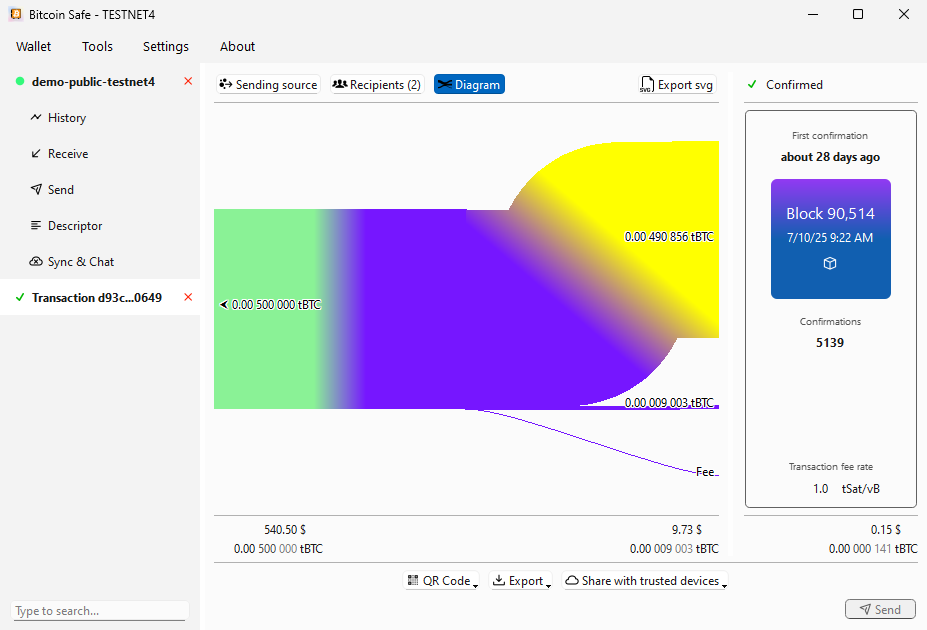
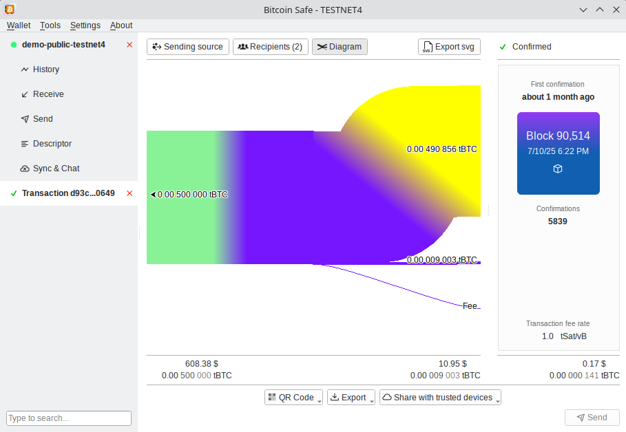

# Bitcoin Safe

#### A bitcoin savings wallet for the entire family

- **Easy Multisig-Wallet Setup**
  - [Step-by-Step instructions](https://bitcoin-safe.org/en/knowledge/setup-multisig-wallet/) for a secure MultiSig setup with [PDF backup sheets](https://bitcoin-safe.org/en/features/pdf-export/)
  - [Test transactions](https://bitcoin-safe.org/en/knowledge/setup-multisig-wallet/) ensure that all hardware signers are ready
  - Full support for [Coldcard Q](https://bitcoin-safe.org/en/knowledge/supported-hardware-signers/coldcard-q/), [Coldcard Mk4](https://bitcoin-safe.org/en/knowledge/supported-hardware-signers/coldcard-mk4/), [BitBox02 / BitBox02 Nova](https://bitcoin-safe.org/en/knowledge/supported-hardware-signers/bitbox02/), [Foundation Passport](https://bitcoin-safe.org/en/knowledge/supported-hardware-signers/passport/), [Jade](https://bitcoin-safe.org/en/knowledge/supported-hardware-signers/jade/), [Jade Plus](https://bitcoin-safe.org/en/knowledge/supported-hardware-signers/jade-plus/), [Trezor Safe 3 & 5](https://bitcoin-safe.org/en/knowledge/supported-hardware-signers/trezor/), [Keystone](https://bitcoin-safe.org/en/knowledge/supported-hardware-signers/keystone/), [Ledger Nano S / S Plus / X / Flex](https://bitcoin-safe.org/en/knowledge/supported-hardware-signers/ledger/), [Specter DIY / Shield / Shield Lite](https://bitcoin-safe.org/en/knowledge/supported-hardware-signers/specter/), [SeedSigner](https://bitcoin-safe.org/en/knowledge/supported-hardware-signers/seedsigner/), [Krux](https://bitcoin-safe.org/en/knowledge/supported-hardware-signers/krux/), using  *QR*, *USB*, and *SD-card* 
- **Secure**: [Hardware signers only](https://bitcoin-safe.org/en/knowledge/hardware-signer-only/)
  - [All wallets require hardware signers/wallets](https://bitcoin-safe.org/en/knowledge/hardware-signer-only/) for safe seed storage 
  - Powered by **[BDK](https://github.com/bitcoindevkit/bdk)**
- **Fast**
  - Electrum/Esplora server
  - [Compact Block Filters](https://bitcoin-safe.org/en/knowledge/compact-block-filters/) with [transaction notifications](https://bitcoin-safe.org/en/knowledge/instant-transactions-notifications/)
- **Multi-Language**
  - [🇺🇸](https://bitcoin-safe.org/en/),  [🇨🇳](https://bitcoin-safe.org/zh/), [🇪🇸](https://bitcoin-safe.org/es/), [🇯🇵](https://bitcoin-safe.org/ja/), [🇷🇺](https://bitcoin-safe.org/ru/), [🇵🇹](https://bitcoin-safe.org/pt/), [🇧🇷](https://bitcoin-safe.org/pt/), [🇮🇳](https://bitcoin-safe.org/hi/), [🇦🇪](https://bitcoin-safe.org/ar/), [🇮🇹](https://bitcoin-safe.org/it/), [🇫🇷](https://bitcoin-safe.org/fr/), [🇩🇪](https://bitcoin-safe.org/de/), [🇲🇲](https://bitcoin-safe.org/my/), [🇰🇷](https://bitcoin-safe.org/ko/), [🇹🇭](https://bitcoin-safe.org/th/), [🇮🇷](https://bitcoin-safe.org/fa/), [🇵🇱](https://bitcoin-safe.org/pl/), [🇪🇸](https://bitcoin-safe.org/ca/), [🇮🇩](https://bitcoin-safe.org/id/), [🇹🇷](https://bitcoin-safe.org/tr/), [🇺🇦](https://bitcoin-safe.org/en/) (more upon request)
- **Simpler** address labels by using categories (e.g. "KYC", "Non-KYC", "Work", "Friends", ...)
  - Automatic coin selection within categories
  - [Transaction flow diagrams](https://bitcoin-safe.org/en/features/money-flow-diagram/), visualizing inputs and outputs, click on inputs and output to trace the money flow
- **Sending** for non-technical users
  - 1-click fee selection via mempool-blocks
  - Automatic merging of utxos when fees are low
- **Plugin [Sync & Chat](https://bitcoin-safe.org/en/plugins/sync-chat/)**
  - Encrypted cloud backup (via nostr) of labels
  - [Label synchronization](https://bitcoin-safe.org/en/features/label-sync/) between different computers
  - [Wallet chat and PSBTs sharing](https://bitcoin-safe.org/en/plugins/sync-chat/) between different computers


### [Available on all platforms](https://bitcoin-safe.org/en/features/cross-platform/)
|  |  |  |
|-----------------------------|-----------------------------|----------------------------|
| Windows                    | Mac OS X                   | Linux                     |


## Comprehensive Feature List

- **Import and Export Capabilities**
  
  - CSV export for all lists
  - CSV import for batch transactions
  - Label import and export using [BIP329](https://bip329.org/)
  - Label import from Electrum wallet
  - [Export of the money flow diagram](https://bitcoin-safe.org/en/features/money-flow-diagram/) to svg
  - Drag and drop for Transactions, PSBTs, and CSV files

- **Wallet Features**
  
  - Simplified address labeling using categories like KYC, Non-KYC, Work, Friends
  - Bump fee on transactions (via Replace-by-Fee)
  - Receive faster (via Child Pays For Parents)
  - Encrypted wallet storage
  - [Backup PDF with Descriptor](https://bitcoin-safe.org/en/features/pdf-export/) (Text and QR code)
  - Message signing via USB and QR

- **Support for all major [hardware signers](https://bitcoin-safe.org/en/knowledge/supported-hardware-signers/)**
  
  - [MicroSD (files)](https://bitcoin-safe.org/en/knowledge/supported-hardware-signers/)
  - [USB](https://bitcoin-safe.org/en/knowledge/supported-hardware-signers/)
  - [QR codes](https://bitcoin-safe.org/en/knowledge/supported-hardware-signers/) (enhanced QR code detection for Laptop cameras)
  - [Animated QR codes](https://bitcoin-safe.org/en/knowledge/supported-hardware-signers/) including [Coldcard/BBQr](https://bbqr.org/) and [UR](https://github.com/BlockchainCommons/Research/blob/master/papers/bcr-2020-005-ur.md) format

- **[Search and Filtering Options](https://bitcoin-safe.org/en/features/search/)**
  
  - [Fast filtering](https://bitcoin-safe.org/en/features/search/) across txids, utxos, labels, dates, amounts, categories
  - [Search across all open wallets](https://bitcoin-safe.org/en/features/search/), txids, utxos, labels, dates, amounts, categories

- **[Languages](https://bitcoin-safe.org/en/features/multi-language/)**
  
  - 🇺🇸 [English](https://bitcoin-safe.org/en/), 🇨🇳 [Chinese – 简体中文](https://bitcoin-safe.org/zh/), 🇪🇸 [Spanish – español de España](https://bitcoin-safe.org/es/), 🇯🇵 [Japanese – 日本語](https://bitcoin-safe.org/ja/), 🇷🇺 [Russian – русский](https://bitcoin-safe.org/ru/), 🇵🇹 [Portuguese – português europeo](https://bitcoin-safe.org/pt/), 🇧🇷 [Portuguese (Brazil) – português do Brasil](https://bitcoin-safe.org/pt/), 🇮🇳 [Hindi – हिन्दी](https://bitcoin-safe.org/hi/), 🇦🇪 [Arabic – العربية](https://bitcoin-safe.org/ar/), 🇮🇹 [Italian – italiano](https://bitcoin-safe.org/it/), 🇫🇷 [French – Français](https://bitcoin-safe.org/fr/), 🇩🇪 [German – Deutsch](https://bitcoin-safe.org/de/), 🇲🇲 [Burmese – မြန်မာ](https://bitcoin-safe.org/my/), 🇰🇷 [Korean – 한국어](https://bitcoin-safe.org/ko/), 🇹🇭 [Thai – ภาษาไทย](https://bitcoin-safe.org/th/), 🇮🇷 [Persian (Farsi) – فارسی](https://bitcoin-safe.org/fa/), 🇵🇱 [Polish – Polski](https://bitcoin-safe.org/pl/), 🇪🇸 [Catalan – Català](https://bitcoin-safe.org/ca/), 🇮🇩 [Indonesian – Bahasa Indonesia](https://bitcoin-safe.org/id/), 🇹🇷 [Turkish – Türkçe](https://bitcoin-safe.org/tr/), 🇺🇦 [Ukrainian – Українська](https://bitcoin-safe.org/en/) (more upon request)

- **Transaction / PSBT Creation**
  
  - 1-click fee selection and mempool block preview
  - Automatic merging of utxos when fees are low
  - Highlighting of own addresses 
  - [Address poisoning detection and warning](https://bitcoin-safe.org/en/features/address-poisoning/)

- **Security and Reliability**
  
  - [No seed generation or storage on mainnet](https://bitcoin-safe.org/en/knowledge/hardware-signer-only/)
  - [Seed storage requires a separate hardware signer](https://bitcoin-safe.org/en/knowledge/hardware-signer-only/)  
  - [Update notifications](https://bitcoin-safe.org/en/knowledge/instant-transactions-notifications/) and signature verification
  - Powered by [Bitcoin Development Kit (BDK)](https://github.com/bitcoindevkit/bdk)

- **Ease of Use for Multisig Wallets**
  
  - [Simplified setup](https://bitcoin-safe.org/en/knowledge/setup-multisig-wallet/) for multisig wallets, including step-by-step instructions and [PDF backup sheet](https://bitcoin-safe.org/en/features/pdf-export/)
  - [Test signing](https://bitcoin-safe.org/en/knowledge/setup-multisig-wallet/) with all hardware signers
  - [Collaborative wallet management](https://bitcoin-safe.org/en/features/collaboration/) including chat and PSBT sharing via nostr and label synchronization between trusted devices
  - Optional custom nostr server 

- **Fast syncing**: 
  - Electrum/Esplora server
  - [Compact Block Filters](https://bitcoin-safe.org/en/knowledge/compact-block-filters/) 


## Installation from Git repository


### Ubuntu, Debian

- Install dependencies: 

  ```sh
  sudo apt-get install qt6-tools-dev-tools libzbar-dev libxcb-cursor0 '^libqt6.*$' 
  ```

- Install `poetry` and run `bitcoin_safe`
  
  ```sh
  git clone https://github.com/andreasgriffin/bitcoin-safe.git
  cd bitcoin-safe
  pip install poetry  && poetry install && poetry run python -m bitcoin_safe
  ```

### Mac

- Clone `bitcoin_safe`
  
  ```sh
  open "/Applications/Python 3.12/Install Certificates.command"
  export SSL_CERT_FILE=$(python3 -m certifi) # to fix ssl errors
  git clone https://github.com/andreasgriffin/bitcoin-safe.git
  cd bitcoin-safe
  ```
 


- *Optional*: dependency `zbar`
  ```sh 
  brew install zbar  
  ``` 
  
- Run `bitcoin_safe`
  
  ```sh 
  python3 -m pip install poetry && python3 -m poetry install && python3 -m poetry run python3 -m bitcoin_safe
  ```

## Development

* Run the precommit manually for debugging

```shell
poetry run pre-commit run --all-files
```

#### Regtest docker environement with electrs and mempool

* install docker

```shell
# see https://docs.docker.com/engine/install/ubuntu/
```

* setting up a regtest environment in docker + mempool instance

```shell
curl https://getnigiri.vulpem.com | sudo bash # see https://nigiri.vulpem.com/#install
sudo nigiri start
xdg-open http://localhost:5000/
```

* This creates
  * esplora localhost:3000
    electrs localhost:50000 
  * and a gui block explorer at http://localhost:5000
* Setup mempool instance

```shell
sudo apt install docker-compose
git clone https://github.com/ngutech21/nigiri-mempool.git

pushd nigiri-mempool
sudo docker-compose up -d
sleep 10
# this is needed because the database needs time to start up 
sudo docker-compose up -d
popd
xdg-open http://localhost:8080/

# if the mempool is endlessly loading, then get the debug output with
sudo docker-compose logs -f mempool-api
```

* this opens a mempool at http://localhost:8080/

#### Control the Regtest environment

* get coins to an address

```shell
nigiri rpc generatetoaddress 1 bcrt1qgsnt3d4sny4w4zd5zl9x6jufc5rankqmgphyms9vz0ds73q4xfms655y4c # mine blocks

# or use the internal faucet
nigiri faucet bcrt1qgsnt3d4sny4w4zd5zl9x6jufc5rankqmgphyms9vz0ds73q4xfms655y4c 0.01
```

<!-- * ## Installation from PyPi

### Ubuntu, Debian, Windows

- Install `poetry` and run `bitcoin_safe`
  
  ```sh
  pip install bitcoin-safe
  python -m bitcoin_safe
  ```

### Mac

- Run `bitcoin_safe`
  
  ```sh
  python3 -m pip install bitcoin-safe
  python3 -m bitcoin_safe
  ``` -->


### Verifying the binaries

- In Linux the appimage and deb file hashes should match perfectly with your own built version.
- The Windows exe files are signed, and therefore the signature needs to be stripped. 
```sh
osslsigncode remove-signature -in signed-binary.exe -out binary-stripped.exe
```
`binary-stripped.exe` hash will match the hash of your built version.


### Qt designer

Qt componets can be explored with the qt designer:

```sh
virtualenv .env-qt-designer
source .env-qt-designer/bin/activate
pip install pyqt6-tools 
pyqt6-tools designer 
```


## Code signing policy


Free code signing provided by [SignPath.io](https://about.signpath.io/), certificate by [SignPath Foundation](https://signpath.org/)


## Privacy policy
This program uses by default
- the electrum/esplora server of [blockstream.com](https://blockstream.com/) to fetch blockchain data
- fetches mempool fee information from [mempool.space](https://mempool.space/)

You can specify your own (personal) server for both in "Network settings".

When enabeling the Sync&Chat feature [default relays](https://github.com/andreasgriffin/bitcoin-nostr-chat/blob/main/bitcoin_nostr_chat/default_relays.py) are used to transmit encrypted data to your approved trusted devices. You can specify your own relay(s) in the Sync&Chat settings.

This program will not transfer any other information to other networked systems unless specifically requested by the user or the person installing or operating it.
